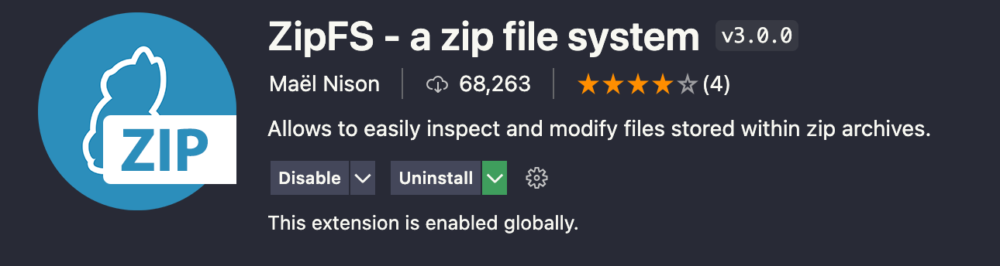
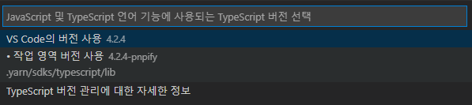

# Next js + yarn berry (zero install) + VS Code

## 프로젝트 생성 순서

1. Typescript를 사용하는 Next js 프로젝트 생성
    ```
    yarn create next-app --typescript
    ```
1. 프로젝트 최상위 경로로 이동 후 yarn version을 berry 버전으로 변경
    ```
    cd [YOUR_PROJECT_PATH]
    yarn set version berry
    ```
1. .yarnrc.yml 파일에 다음 내용을 삭제 또는 주석처리 합니다.
    ```
    nodeLinker: node-modules // delete or comment out
    ```
1. yarn 실행 (node_modules 폴더 제거 및 .yarn 폴더 생성)
    ```
    yarn
    // or
    yarn install
    ```
1. .gitignore 파일에 다음 내용을 중 하나를 추가해주세요.  
    (.gitignore 파일 세팅이 귀찮다면 https://www.toptal.com/developers/gitignore/ 참고)
    ```
    ### yarn ###
    # Zero-Install을 사용하겠다면?
    .yarn/*
    !.yarn/cache
    !.yarn/patches
    !.yarn/plugins
    !.yarn/releases
    !.yarn/sdks
    !.yarn/versions

    # Zero-Install을 사용하지 않겠다면?
    .yarn/*
    !.yarn/patches
    !.yarn/releases
    !.yarn/plugins
    !.yarn/sdks
    !.yarn/versions
    .pnp.*
    ```
1. VS Code Plugin 'ZipFs' 설치
    
1. VS Code 에디터 설정 (참고: https://yarnpkg.com/getting-started/editor-sdks)
    ```
    yarn dlx @yarnpkg/sdks vscode

    ```
    VSCode를 실행하여 Typescript 버전을 선택해주세요.
    